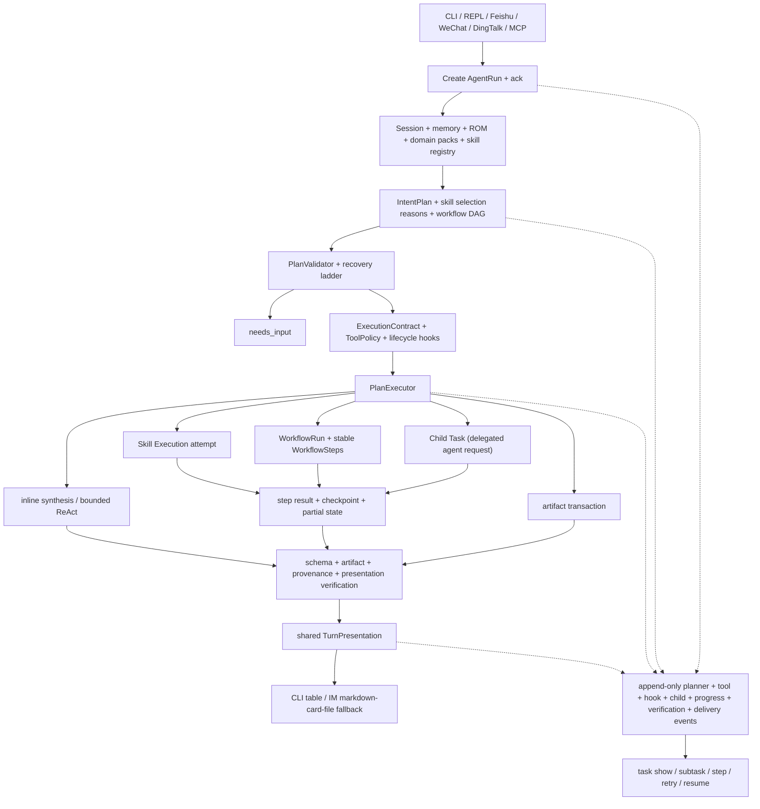

# Architecture (as-built)

For executable agent and skill validation scenarios, see
[`agent-validation-guide.md`](agent-validation-guide.md). For command-line and REPL validation,
see [`cli-validation-guide.md`](cli-validation-guide.md). For the executable runtime contract
(modes, hooks, steer, recovery, isolation, and quality evaluation), see
[`agent-runtime-harness.md`](agent-runtime-harness.md).

OmniScientist is a layered, local-first distillation of the HelixForge research-agent OS.
This document describes the code as actually implemented under `src/omni/`.

## Layers & packages

```
src/omni/
├── cli/                 # Typer CLI: command tree, REPL, render, init/doctor/serve
│   └── commands/        #   config/skills/mcp/project/memory/task/session/profile/channel/cite +
│                        #   status/resume/exec/replay/serve/init/doctor/update +
│                        #   research: lit/verify/bench/hypo/claim/evidence/run/source
├── agent/               # OmniAgent orchestrator — the single request entry point
├── core/                # Agent core
│   ├── llm/             #   LLMClient + providers (mock, openai_compatible)
│   ├── react_agent.py   #   bounded ReAct tool-loop
│   └── system_prompt.py #   system prompt assembly (+ research-workflow block & live research brief)
├── skills_runtime/      # SKILL.md parsing, registry, 4-form executor, capability resolver, skill tools
│   └── builtin_tools/   #   read/write/edit/grep/glob/bash/web_fetch (CC-compatible) + research tools
├── research/            # arXiv client · ROM · corpus · domain packs · rich artifacts
│                        #   · literature/trial connectors · tools · verify · bench
├── memory/              # 5-layer (M1–M5) file/SQLite memory + recall + notebook
├── runtime/             # durable runs/tasks + hooks + isolation + DAG/checkpoints + presentation
├── eval/                # deterministic behavior, coverage, and research-quality evaluation
├── compat/              # MCP server bridge, MCP client, Codex/Claude integration writers
├── channels/            # Channel abstraction + CLI + optional WeChat/Feishu/DingTalk adapters
├── storage/             # SQLAlchemy async models + SQLite engine + file artifact store
├── config/              # layered TOML settings + path resolution
└── data/                # default role.md (built-in SKILL.md packages live in the top-level skills/)
```

> Built-in skill *content* lives in the top-level [`skills/`](../../skills/) directory (bundled into
> the wheel), not under `src/omni/`. A `python_engine` skill keeps its `engine.py` inside its own
> skill folder and reuses only omni's small public runtime (`omni.research` and, where needed,
> `omni.memory.library`); there is no `skills_builtin/` package.

## Request flow (one turn)



`OmniAgent.handle_turn()` (see `agent/orchestrator.py`):

1. ensure a `Session` row, persist the user message, create an `AgentRun`, and emit the channel ack
   before planning so `/task` immediately shows `running`
2. recall relevant memories (`memory.recall`), build a live **research brief** (open hypotheses /
   unsupported-claim count from the ROM) + intent-matched skill suggestions + the compact loaded
   skill catalog + enabled domain-pack guidance, and assemble the system prompt
3. build and persist `IntentPlan`, `ExecutionContract`, `ExecutionPlan`, and `VerificationPlan`;
   validate and route recoverable findings through repair, degradation, `needs_input`, or bounded
   ReAct handoff
4. build the policy-filtered tool surface: builtin tools (incl. the **research tools** `record_hypothesis` /
   `record_claim` / `cite_source` / `add_evidence` / `search_corpus` / `log_run`) + engine/exec
   sync skills + `find_skill` / `use_skill` / `run_skill` / `run_workflow`
   (+ any external MCP tools)
5. execute through `PlanExecutor`: direct synthesis, bounded ReAct, a subtask, a
   dependency-ready workflow DAG, or an artifact transaction; lifecycle hooks and durable
   steer/cancel controls apply at their safe boundaries
6. persist step results/checkpoints, assistant output, artifacts, provenance, and session memory;
   retry starts a linked child attempt while resume reuses a persisted checkpoint
7. run verification, then render one shared `TurnPresentation` through the CLI or channel renderer
8. append the full planner/tool/hook/task/verification/delivery chain to the run event stream and
   drain inline tasks (one-shot CLI) or leave them for the `omni serve` daemon

### CLI live progress (Claude Code / Codex-style transcript)

The same event stream that lands in the run log also narrates the turn live, but only on the CLI.
`handle_turn(on_tool_event=…)` receives phase events — `plan` (boundary/model planning, validation
summary, recovery decisions, workflow dispatch), `start`/`done` (every gateway tool call with
arguments, result, duration), `task_start`/`task_progress`/`task_done` (subtasks, hierarchical
`workflow.step.*` stages incl. nested tool calls), plus `budget`/`transcript` notices.

`cli/live_display.py` (`TurnDisplay`) renders that stream as a running transcript: `◆ plan …` lines
for intent/steps/warnings, `⚙ tool(args)` / `✓ tool · 1.2s · preview` lines with sensitive argument
values masked, `[2/5] skill ▸ start … ✓ done · 3.4s` step hierarchy, and a transient Rich status
line (spinner · stage · elapsed · tool count) between events. Token streaming and the status line
share the terminal cooperatively: the first streamed token stops the status line and event lines
close any open stream line first. Verbosity is `display.verbosity` in config (`quiet`/`normal`/
`verbose`), `-v`/`-q` on `omni chat`/`omni exec`, or `/verbose` in the REPL.

IM channels (WeChat / Feishu / DingTalk) call `handle_turn` without `on_tool_event`, so they are
structurally unaffected; the durable task log (`/task show`, `/why`) remains the authoritative
record either way.

## Planning, Scheduling, and Workflow State

The model remains the semantic planner. OmniScientist gives it a bounded catalog of currently
loaded capability contracts, descriptions, delivery modes, and output contracts. No lexical
pre-filter chooses a subset from the user's language. The model proposes capabilities and
deliverables without needing the full `SKILL.md`; the runtime resolves providers and validates the
locked plan. The execution layer can then run:

- `run_skill` for one skill. `mode=auto` runs sync skills inline, waits for async skills in the
  foreground when the CLI is waiting, and returns a durable background Skill Execution when the
  caller detached or the channel should not block.
- `run_workflow` for two or more skills, ordered dependencies, or cases where upstream results must
  feed downstream steps. The user request is a `tasks` row, the DAG execution is a
  `workflow_runs` row, each logical node is a stable `workflow_steps` row, and every skill-backed
  step creates its own retryable `subtasks` Skill Execution attempt.

The durable object graph is deliberately explicit:

```text
Task (one user request)
├── WorkflowRun (one validated DAG execution)
│   ├── WorkflowStep (stable logical node)
│   │   ├── Skill Execution attempt 1
│   │   └── Skill Execution attempt 2 (retry_of attempt 1)
│   └── WorkflowStep (delegation) ──> Child Task
├── direct Skill Execution
└── direct Child Task
```

A Child Task is a bounded delegated agent request and may own its own workflow; it is not stored as
a Skill Execution and a workflow is never represented by `skill_name="workflow"`. A retry preserves
the WorkflowStep id and creates a new Skill Execution id. This keeps orchestration, logical progress,
execution attempts, and recursive delegation independently inspectable.

The workflow runtime executes a dependency DAG rather than assuming one global serial list.
Dependency-ready steps form deterministic waves; only a step/skill contract that explicitly sets
`concurrent_safe=true` may share a wave. Every wave persists completed ids, pending work, step
results, and recovery metadata. `task retry` creates a linked fresh attempt, while `task resume`
continues the same child from its checkpoint. See
[`agent-runtime-harness.md`](agent-runtime-harness.md) for the execution and recovery contract.

The runtime applies deterministic guardrails after semantic planning. `SkillArbitrator` resolves a
requested capability or deliverable from registry contracts and provider priority. It preserves a
valid explicit provider, rejects unavailable or unsafe providers, and records selection rationale in
the plan audit. The locked validated plan is not rewritten by the executor.

### Scheduling: one contract, durable approval, honest readiness

Two surfaces create schedules — the `omni schedule add` CLI and the `schedule_task` agent tool —
and they used to diverge (the incident: the model composed `omni schedule add --at …`, an option the
CLI did not have, and naive one-time times meant UTC on the CLI but local via the tool). The
scheduling control plane (`scheduling/`) removes that whole class of drift by funnelling every
surface through **one canonical request and one application service** (the "one core, thin adapters"
shape Codex uses):

- **One contract (`scheduling/contracts.py`).** A `ScheduleCreateRequest` (trigger + goal/skill +
  actor) is the only thing any surface builds. `to_cli_argv()` deterministically serialises a request
  into the exact `omni schedule add` argv, and a test round-trips it through the *real* Typer parser —
  so a surfaced fallback command is guaranteed to parse. Nothing hand-composes a schedule command.
- **One time-policy.** `resolve_once_instant()` is the single place a one-time time is interpreted: a
  naive `at` is the operator's local wall-clock (or an explicit IANA `--timezone`), converted to a UTC
  instant for storage — never face-value UTC. A one-time trigger already in the past is refused with a
  structured `needs_input` + recovery choices instead of being silently created to never fire.
- **One service, two consent paths (`scheduling/service.py`).** `ScheduleService.create()` validates
  the target skill, normalises the trigger, then decides consent by *origin*: a local/CLI request is
  created directly (the owner typed it), while an IM-originated request — whose approver is the owner
  on a *different* process and whose turn cannot block — is persisted as a **durable approval
  proposal** (`ScheduleActionProposalORM`). This is Codex's request/response-by-id approval made
  durable: `omni schedule approve <id>` later executes the *exact stored, sha256-digest-checked*
  payload (never prose re-composed into a command), idempotently. Because the service owns consent,
  `schedule_task` is no longer a blanket-`sensitive` tool that the daemon flat-denies; it stays
  available on IM and routes to a proposal.
- **Truthful outcome + verification (L5).** Every terminal result (created / awaiting-approval /
  needs-input / rejected) is recorded as one `schedule.resolved` event, and the SCHEDULE plan's
  verification *requires* that event — so a turn that claims success in prose without actually
  scheduling fails verification instead of reporting a schedule that never existed.
- **Honest readiness (L6).** A schedule only fires when it is registered **and** `schedules.enabled`
  **and** a runner (`omni serve` / the home service) is live. `ScheduleCreateResult` keeps these as
  independent axes and the deterministic summary states them plainly ("no runner is active: start
  `omni serve` …") rather than over-promising "it will run".

#### One brain, headless door: how a due goal executes

The deployed regression the user hit was *execution* asymmetry, not scheduling: a due goal ran as a
single, bounded `agent-goal` ReAct loop (a prompt sub-agent), so a multi-deliverable goal ("fetch an
abstract, draw a RAG figure, write a paper") hit that loop's iteration ceiling after one deliverable
and returned degraded — a completely different code path from the interactive orchestrator turn that
would have decomposed it. The fix removes the second brain: a due **goal** schedule
(`schedules.execution_mode="headless_turn"`, the default) fires a full **headless orchestrator turn**
through the same `handle_turn` → planner → workflow → verification pipeline an interactive turn uses.
A multi-deliverable goal is therefore decomposed into separately-budgeted, separately-verified steps
instead of one flat loop. An explicit-skill schedule (`omni schedule add <skill>`) keeps the direct
durable enqueue.

- **One door (`Orchestrator.run_scheduled_goal`), wired as the scheduler's `goal_runner`.** When
  `Scheduler.run_due` claims a due goal occurrence it materialises the run's owning task (carrying the
  schedule's autonomy grant) and launches the turn *detached from the poller tick* (`asyncio.create_task`,
  tracked in `_inflight`) so planning/execution never blocks the ticker. `drain_fires()` awaits those
  detached turns for one-shot callers (`omni schedule run`, tests); `shutdown()` cancels them so none
  outlives the agent/DB.
- **Unattended, and it stays that way.** The turn runs with `origin="schedule"` ⇒ `ExecContext.autonomous`
  (no interactive approver: sensitive tools clear only through the owning task's pre-authorised grant
  via the approval-gate preauthorizer, exactly as a human "approve for this task") and
  `allow_scheduling=False` (the coordinator surface omits `schedule_task`, so a scheduled run cannot
  recursively spawn schedules).
- **Verification-driven bounded auto-continuation (Phase 3).** If the turn finishes `degraded`/`failed`,
  up to `schedules.max_continuations` (default 1) follow-up turns are enqueued with a "finish only the
  missing deliverables, do not redo delivered work" directive carrying the outstanding items forward;
  `needs_input`/`passed` are never continued (nobody is there to answer; done is done).
- **Always accounted for.** The verified outcome — or, if the run crashes, an honest error note — is
  delivered to the origin channel's inbox as a `scheduled_goal` `TaskNotification`; `run_scheduled_goal`
  never raises into the scheduler tick. Observability (`schedule show`/`list`) binds the schedule's
  "last run" to the turn's newest subtask so a headless run is not a black box.
- **Contained iteration-cliff mitigation (Phase 2).** Prompt sub-agents (including `agent-goal` when
  used as a subagent) now get the coordinator's cheap first-tier microcompaction (shrink the oldest
  tool observations once the transcript passes the model-window budget), so a long run keeps making
  progress instead of starving its own context.

### Reactive typed-plan control plane

Omni's planner is semantic, but its output is not execution authority. The control plane turns the
model proposal into a content-addressed typed plan, validates objective contracts, optionally
repairs one bounded set of model-owned schema errors, and then binds approval and execution to the
same accepted revision. It deliberately does not try to prove at planning time that a schema-valid
choice is the user's intended semantic choice.

```mermaid
flowchart LR
  U["User turn"] --> C["Planning contract snapshot"]
  C --> M["Semantic proposal<br/>(exact shortlisted provider schemas visible)"]
  M --> R0["Proposed PlanRevision"]
  R0 --> B["Bind exact provider<br/>(source + version + contract hash)"]
  B --> X["Compile + validate detached candidate"]
  X --> V["JSON Schema + ResolverEvidence findings"]
  V --> Q{"Repairable model-owned schema error?"}
  Q -- "no" --> A["Accepted PlanRevision"]
  Q -- "yes, policy permits" --> P["One bounded PlanPatch call"]
  P --> G["Clone, recompile, revalidate,<br/>strict-improvement gate"]
  G -- "accepted" --> A
  G -- "rejected" --> F["Deterministic recovery / ReAct / needs_input"]
  Q -- "repair disabled" --> F
  F --> A
  A --> H["Approval authority fingerprint,<br/>if plan mode"]
  H --> E["Plan + live contract snapshot check"]
  E --> T["ToolGateway contract + policy gate"]
  T --> S["Provider execution + self-assessment"]
  S --> D["Deliverable verifier"]
```



#### One execution truth

`IntentPlan` carries `revision`, `revision_hash`, `parent_revision_hash`, and `revision_source`,
plus exact `provider_bindings` and resolver-owned `resolver_evidence`. `PlanRevision`
(`agent/plan_revision.py`) stores a detached full plan snapshot, parent hash, finding ids, and a
deterministic diff. Its SHA-256 content hash covers provider and resolver provenance, workflow
inputs, provider inputs, policies, verification, and the actual execution plan; the four revision
metadata fields are excluded so the hash cannot refer to itself.

Planning history is append-only:

- `plan.revision.proposed` records the raw typed proposal.
- `plan.revision.candidate` records compiler, resolver, deterministic-repair, model-repair, and
  recovery candidates. Exactly one final `plan.revision.accepted` becomes authoritative.
- `plan.revision.rejected` retains a malformed, stale, invariant-breaking, or non-improving model
  candidate without making it executable.
- `plan.validated` is emitted once, after recovery selects the final accepted revision. It is not an
  optimistic event emitted before repair.
- `plan.execution.bound` records the final revision number and hash immediately before dispatch.

The task's `plan_json` is the current full authoritative projection. Revision events retain a full
historical snapshot when its final serialized JSON fits the 256 KiB event budget, measured in UTF-8
bytes after JSON escaping. An oversized revision retains its content hash, parent hash, source/stage,
finding ids, catalog/contract hashes, validation status, bounded diff metadata, and a bounded plan
preview. That clipped event remains tamper-evident provenance, not a reconstructable full historical
body. Before execution, Omni recomputes the accepted plan hash and requires it to equal the persisted
plan hash. It also recomputes the live catalog and provider-contract snapshots and requires both to
match the accepted revision.

Plan mode binds more than plan content. `ExecutionAuthority` fingerprints the canonical plan hash,
catalog hash, contract hash, and the sorted exact sensitive-tool grants. The task stores
`current_authority_fingerprint` and `approval_authority_fingerprint`; presenting a new approval
atomically copies current authority into approval authority and clears old grants. Approval is one
conditional update over task status, both fingerprints, and the exact persisted JSON. Its winner
installs the new grant set by replacement, never union, so concurrent approval, contract drift,
same-tick plan replacement, and privilege residue all fail closed. The invariant is:

```text
accepted revision hash
  == persisted current-plan hash
  == execution-bound hash

approval authority fingerprint
  == hash(accepted plan + catalog + contracts + exact prospective grants)
  == current authority fingerprint at claim
  == bound authority fingerprint at execution
```

Every concrete plan consumer also carries a provider authority. For a skill this includes its exact
source, manifest/contract, engine or CLI binding, admission/replay metadata, primary executable, and
a deterministic digest of every regular file reachable under the provider root. Only VCS metadata
and explicit transient cache directories (`__pycache__`, `.mypy_cache`, `.pytest_cache`, and
`.ruff_cache`) are excluded. Build products, generated artifacts, weights, templates, manifests, and
other runtime assets are therefore part of the authority if they live below that root; providers
must write mutable output elsewhere or intentionally invalidate queued authority. A symbolic link
at any included path outside those excluded directories, or an unreadable/incomplete tree, is
non-executable because Omni cannot seal its target deterministically. Static CLI argument files are
hashed as well. Dotted
modules are resolved through filesystem finders without importing parent packages, so merely
planning an approval-gated provider cannot execute its `__init__`.

Native synthesis, delegated child agents, and ReAct bind a versioned I/O contract and Omni runtime
build identity. Workflow steps and skill-execution rows persist the exact expected provider
snapshot at enqueue. Ordinary dispatch recomputes it immediately before execution; source removal,
same-name source substitution, code/schema/admission drift, or an Omni local update fails closed with
a re-plan/re-submit instruction. No queued operation silently acquires the new implementation under
an old approval. An explicit user `task retry` or `task resume` is a new reauthorization to the
currently resolved provider: it preserves the immutable authority root and appends a
content-addressed, hash-linked renewal. Retry creates a linked fresh execution attempt; resume
continues the persisted attempt/checkpoint in place. Dispatch validates the root and every renewal
link, resolves the latest applicable provider for the exact consumer, and requires both the logical
workflow step and execution row to equal that renewal head before provider code can run.
An explicit `skill_source` is authority rather than a lookup preference: planning, contract
materialization, validation, repair-schema projection, recovery, authority sealing, and dispatch all
resolve the exact `(source, name)` entry. If it disappears, Omni rejects the plan or execution instead
of falling back to the same-named catalog winner. Legacy `input._skill_source` is promoted to the
top-level step authority during validation and removed before provider input compilation.

No validator, resolver, or recovery rung is allowed to mutate an already-recorded revision. It works
on `deep_clone_plan(...)`; a successful change creates a child revision, and an unsuccessful change
is only an audit event.

#### Three judges, each at the boundary where it has evidence

The host no longer contains a central semantic constraint interpreter. Schema-valid preferences
such as `figure_kind=generic` versus `figure_kind=rag` are not objectively decidable from a generic
planning layer; adding host phrase detectors merely moves provider knowledge into an incomplete
enumeration. Omni instead separates three kinds of judgement:

| Question | Authority | Failure posture |
|---|---|---|
| Are provider arguments objectively legal? | Exact provider JSON Schema | Fail closed before execution |
| Is a resolver-owned value grounded? | `ResolverEvidence` derived from that exact schema | Fail closed until matching evidence exists |
| Does the produced deliverable satisfy its domain contract? | Provider self-assessment + task verifier | Missing/failed fails; unknown/degraded is explicit |

**Objective provider schema.** The shortlisted exact provider's complete input schema is visible to
the planner, including nested properties, enums, descriptions, and `x-omni` selection guidance.
After provider selection, `ProviderInputCompiler` and `PlanValidator` validate the actual arguments
against that same schema. Full contracts reject unknown keys and report precise JSON Pointers,
schema keywords, allowed values, actual values, and the exact provider identity. This mechanism
applies to every new skill and field without adding field-specific host code.

**Resolver evidence.** A provider schema may mark an input as resolver-owned. The host derives a
`ResolverEvidence` slot from the exact `(source, name, version, contract hash, consumer, field)`
binding. Locally normalised user ids can achieve `user_exact`, existing paths `local_exists`, and a
title/model-derived identifier requires `grounded_search`. Syntax alone never proves that an id
belongs to a named paper. Evidence is rematerialized at validation and at the final execution bind;
stale, mismatched, or absent evidence produces a blocking `grounded_binding_unverified` finding and
cannot be repaired by the model.

**Provider quality.** A provider may declare `metadata.helixforge.quality_contract` with required
checks and assessment/retry policy. At execution it emits
`omni.deliverable-assessment/v1`: effective inputs, per-criterion status, evidence references,
feedback, and retryability. The host overwrites its identity fields from the sealed workflow step,
binding the assessment to the exact source, version, provider contract hash, step, and deliverable;
a provider cannot self-assert another provider's authority. The generic verifier matches those
identities and aggregates the declared checks without knowing what “RAG”, “landscape”, or “strict”
means.

Required quality has explicit failure semantics:

- a missing required assessment or criterion fails verification;
- `failed` fails verification;
- `unknown` and `degraded` produce a degraded verdict and remain visible in evidence;
- `passed` counts only when the assessment identity matches the task contract;
- no host fallback may manufacture a domain pass when a provider cannot evaluate a check.

#### One bounded objective repair

Healthy plans add zero model calls: the initial planner sees the selected contract and binds inputs
in its normal call. Local compilation and resolver validation own offline, mock, and CI behavior.

If an open finding is an objective JSON Schema error on a model-owned provider input, policy may
permit exactly one `submit_plan_patch` call. The prompt contains the user request, minimal findings,
current values, and sanitized complete schemas for only the exact selected providers. It does not
receive the full plan, compiled caches, policy/approval state, secrets, or unrelated providers. The
host derives the JSON-pointer allowlist from current findings; the model cannot add paths or grant
itself ownership. Applying a patch:

1. rejects stale base hashes, unknown/duplicate findings, duplicate paths, unsupported operations,
   resolver/host/runtime fields, and policy/identity/DAG/budget changes;
2. applies operations to a clone and clears derived provider-input caches;
3. rebinds the exact provider and reruns structural schema plus resolver validation;
4. requires every targeted finding to disappear, no safety/blocking finding to remain, all
   deliverables and step identities to survive, and the finding score to improve strictly;
5. accepts a child revision or records `plan.revision.rejected` and uses normal recovery.

A schema-valid semantic preference never triggers this repair. The budget is fixed at one and the
path is skipped for `mock`, `omni-mock`, offline, and scripted providers.

After execution, a failed/degraded provider assessment may request one quality retry. Admission is
also host-controlled: the provider contract must opt in, the assessment must be retryable, the
concrete provider must be replay-safe, and a side-effecting provider must supply an idempotency key.
The persisted attempt count enforces `max_attempts=1` across process restarts. Feedback is passed only
through the provider-declared feedback field; otherwise the result is verified as-is.

#### Execution gate and replay authority

`ToolGateway` remains the final shared boundary for coordinator tools, skills, workflow steps,
native runners, and subagents. Invocation order is:

```text
exact tool lookup
  → deep-freeze the admission argument snapshot
  → strict input-schema validation
  → local output-schema definition preflight
  → resolve any generic wrapper to its concrete target
  → tool policy and per-tool limits
  → pre-tool hook / approval / resource lock (detached copies only)
  → compare the canonical argument hash and revalidate the actual execution value
  → execute
  → output-instance validation
  → post-tool hook with the final validated outcome
  → structured event
```

An input-contract violation is rejected before execution. The argument object used for admission is
deep-frozen before any asynchronous observer runs. Start/done events, hooks, approvals, resource
selection, and the task recorder each receive detached data; they cannot mutate the value that a
catalog tool receives. Compatibility callers that provide a zero-argument execution closure are
checked again immediately before provider start: both schema validity and the canonical argument
hash must still equal the admission snapshot, so even a schema-valid A→B rewrite fails closed with
`execution_started=false`. The output schema itself is also compiled
from a private deep snapshot before authorization, budget charging, hooks, approval, locks, or
provider code. Preflight and post-execution validation use that same snapshot, so provider code
cannot change the contract after admission. A scope-aware in-memory registry resolves local JSON
Pointers, anchors, dynamic anchors, and bundled `$id` resources; its retrieval callback rejects
every non-bundled network, file, or custom URI. This also follows a local Pointer target that becomes
an active schema, instead of letting an external reference hide under an extension key. A malformed
schema, unresolved local reference, or unavailable external reference therefore fails with
`execution_started=false` and `side_effect_maybe_committed=false`; external references are never
fetched over network or file I/O. Only a provider result that violates an already valid output
schema is failed with `execution_started=true` and `side_effect_maybe_committed=true`; the runtime
does not pretend the operation was safely undone. The post-tool hook observes that final failure,
not a provisional success emitted before output validation. Automatic retry authority is host metadata
(`replay_safe`) on the concrete `ToolSpec`, deliberately omitted as a model-writable argument.
Non-replay-safe calls get no automatic execution retry; replay-safe transient failures use the
bounded retry policy.

`run_skill` and `use_skill` are routing transports, not authority boundaries. The wrapper and its
resolved concrete target must both pass allow/block policy; one logical call consumes budget once,
while the concrete skill receives the owner hook, approval, resource lock, and schema checks. The
model-facing trace still shows one lifecycle. Native final synthesis is also a typed gateway
provider, with its input and deliverable output validated before the workflow step can succeed.
Explicit skill/tool domain failures are recorded as failed rather than transport-successful; the
versioned command-result envelope deliberately keeps a non-zero process outcome separate because
its output can still be useful evidence.

The gateway's optimized inner paths prove their own preconditions: contract-only execution requires
the exact active name/arguments/sensitivity frame, and nested concrete execution requires an active
outer frame. Each frame owns a shared, revocable one-shot lease: an `asyncio.create_task` child may
copy the context but cannot reuse it after the parent invocation returns; contract-only authority is
exact in name, arguments, and sensitivity, while delegated authority is exact to one concrete
target and consumable once. Future providers therefore cannot bypass policy or budget by choosing
an internal convenience method. Pre-execution rejection markers carry a module-private host seal;
constructing the public compatibility mapping, or returning a dictionary that merely spells
`approval_required` or `policy_violation`, conveys no rejection authority. Such values remain
post-execution provider output and must pass the output contract. A sealed rejection from a nested
concrete gateway retains its provenance through `run_skill`/`use_skill`.

#### Codex-style interaction and low-noise presentation

Normal mode presents the stable user lifecycle — planning, executing, verifying, terminal result —
instead of exposing internal rung numbers or transient findings as failures. A successfully repaired
objective input error is silent or a neutral progress replacement; rejected revisions and complete
finding detail remain available in `--verbose`, `/verbose verbose`, task JSON, and the event stream.
`needs_input` is a resumable pause with one actionable question, never a
`verification_failed`-looking terminal error.

The busy composer has an explicit destination contract:

- **Enter** steers a semantic ReAct turn at its next safe boundary.
- **Tab** or `/queue <message>` queues exactly one next turn.
- **Esc** or `/stop` requests cooperative cancellation; repeating stop in the same turn
  force-cancels it, and completion resets the sequence.
- Read-only/UI commands that are safe during a turn run immediately; unsafe commands are refused
  instead of being silently deferred.
- If the task finishes in the same tick that a steer is submitted, the atomic active-task insert
  rejects the stale steer and the exact text is reclassified into the next-turn queue once — no loss,
  duplication, or cross-task delivery.
- A steer is durably marked applied only after a ReAct boundary drains it. Terminal settlement
  retries a transient acknowledgement failure; a process-local delivery receipt prevents the
  foreground composer from duplicating already-injected text while durable storage catches up.
- Task steering has an execution-epoch state independent of display/audit stage:
  `closed -> open -> sealed`. `execution.finished` or `react.finished` seals it monotonically;
  later cost, audit, or plan writes cannot reopen it. The same `steering_status="open"` predicate
  participates in the SQLite control insert, so a stale writer loses atomically and creates no row.
- A deterministic workflow or single-skill runner has no model boundary where natural-language
  steering can take effect. The foreground transfers such an unapplied Enter submission once to the
  next-turn queue. Detached `task steer`/IM commands reject it up front with a follow-up hint instead
  of claiming that an orphaned instruction was accepted; cooperative cancel remains available.
- Durable control rows follow `pending -> consumed -> applied` or
  `pending|consumed -> requeued`. `requeued` transfers sole ownership to the next-turn queue, so a
  resumed old task cannot replay it. Each ownership transition and its lifecycle event commit in one
  SQLite transaction. A claimed row records its local consumer PID: a dead consumer
  is recoverable immediately, a live consumer cannot be preempted during its 30-second lease, and a
  legacy row without a PID becomes recoverable after that lease. These crash paths are intentionally
  at-least-once: Omni cannot prove whether an unacknowledged external side effect happened
  immediately before a hard process death, so skills with such effects still need
  idempotency/replay-safety contracts.

#### Operational controls and compatibility

Objective validation and resolver evidence are always enforced; neither has an observe/legacy
rollout mode. The remaining planner repair control is deliberately narrow:

```toml
[planner]
model_repair = "auto"          # off | allowlist | auto
model_repair_capabilities = ["artifact.figure"]  # consulted only in allowlist mode
```

- `off` removes the optional repair call while JSON Schema and resolver gates remain active.
- `allowlist` permits one objective-schema repair for named capabilities.
- `auto` permits one objective-schema repair for trusted exact full-contract providers.
- No setting can make resolver-owned facts model-repairable or authorize a semantic detector.

The compatibility boundary is one-way. Persisted v1 plans from the retired semantic-binding
implementation may retain
`requested_constraints` and `binding_records` keys so historical hashes and audit views remain
stable. Deserialization preserves them as opaque read-only data; planning, validation, repair,
approval, recovery, and execution do not consume them. New v2 plans use `provider_bindings` and
`resolver_evidence` and do not write the retired keys.

The focused offline acceptance corpus is
`cli/tests/eval/test_objective_provider_quality_offline_corpus.py`. It must exercise the full
`ModelIntentPlanner -> IntentPlanner -> PlanPipeline` path and prove:

- exact shortlisted schemas are visible to the planner and exact source-qualified providers are
  sealed into accepted, persisted, and execution-bound revisions;
- nested type/enum/required/format/additional-property errors fail before provider execution and
  expose patchable JSON Pointers without exposing unrelated contracts or policy state;
- healthy plans make zero repair calls, an eligible objective error makes at most one, and
  stale, resolver-owned, identity-changing, or non-improving patches are rejected and audited;
- resolver evidence is exact-provider and exact-field scoped, survives accepted revisions, and
  is rechecked at final execution binding; a plausible but ungrounded identifier never executes;
- provider assessments are matched to their deliverable, step, provider binding, and contract
  hash; missing/failed requirements fail while unknown/degraded requirements cannot become pass;
- a quality retry occurs at most once and only for a retryable assessment from a replay-safe
  provider, with an idempotency key whenever side effects may have committed;
- legacy persisted fields remain readable but cannot create evidence, patch authority, a
  provider binding, or a passing verification result;
- accepted, persisted, approval-bound, and execution-bound plan hashes remain identical, and
  non-replay-safe operations are never duplicated.

Provider-authority, gateway, steering, persistence, and changed-code coverage gates remain
independent. They are not counted as provider-quality accuracy and cannot be used to make an empty
quality corpus pass.

### Plan validation and the recovery ladder

Before a turn executes, `PlanValidator` (`agent/plan_validator.py`) *classifies* the plan into
structured `PlanFinding`s with a `severity` of `safety`, `blocking`, or `degraded`; the legacy
`errors`/`warnings`/`degraded_warnings` lists are derived views. `plan_recovery.recover`
(`agent/plan_recovery.py`) then *routes* to the next executable state, so a non-safety rejection is
never a dead end (no more `plan_validation_failed` for recoverable causes) — matching how Claude
Code / Codex / OpenClaw treat a skill failure as an observation to adapt to, not a terminal error.
This ladder is the deterministic floor after objective schema/resolver validation and the optional
one-patch phase; a repair that changes the plan is always sealed as a new accepted revision:

- **Rung 0 — safety hard stop.** Over-privilege policy findings (a tool both allowed and blocked,
  negative limits) stop the turn and are never swallowed by degradation.
- **Rung 1 — grounded repair (single-shot).** An identifier-bound capability
  (`paper.fetch.arxiv`) given a *title* instead of an id is rerouted to a producer capability that
  legitimately accepts free text (`literature.search`, via the data-driven
  `capabilities.CAPABILITY_FALLBACK_PRODUCERS` map). The id is never invented; hits come from a real
  search. The repaired plan is re-validated exactly once (`allow_repair=False`) to prevent loops.
- **Rung 2 — degrade / prune.** A degradable step (a `support` role or `continue_with_partial`
  skill, or an `optional`/non-required step) with unsatisfiable input is pruned and its dependents
  are detached, so the remaining deliverables (e.g. the architecture figure) still run — the same
  partial-completion policy the workflow runtime already applies at execution time.
- **Rung 3 — needs_input.** When the only blocker is a single user-suppliable field (an arXiv
  id/URL), the turn asks a concrete follow-up instead of failing.
- **Rung 4 — ReAct handoff (the floor).** Any other recoverable case is handed to the capable,
  safety-bounded assistant (the same default agent), with the findings injected as context. The
  handoff stays under the normal `tool_policy` — no self-granted tools.

Each decision is recorded as a `plan.recovery` run event (`action`, `rung`, `findings`, `notes`),
and the recovery notes are surfaced through `degraded_warnings` in every channel.

### Intent routing: one semantic planner plus deterministic protocol boundaries

Semantic intent is the model's job; deterministic runtime code is reserved for four things only:
safety/permissions, parsing, execution, and output/edit contracts. OmniScientist keeps **one brain**:
there is no natural-language classifier racing the model and no keyword "rule brain" that fakes
intent when a model is absent. Crucially, the model still only proposes a
**capability**; the runtime picks the trusted provider and validates its input contract through
`skill_arbitrator` and the skill registry. That capability-indirection and contract layer is a
stronger anti-hallucination / policy boundary than raw tool-calling, and everything below builds on it
rather than flattening it away.

- **Editing a figure is a model-chosen capability.** `artifact.revise` (edit the attached figure)
  and `artifact.figure` (a brand-new figure) are the two capabilities the planner may propose. The
  model routes to `artifact.revise` for *any* change to the attached figure; the runtime then decides
  minor-vs-major mechanically — an in-place, contract-validated DOT patch when the target + colour are
  explicit (`artifact_revisions.revise_artifact`), otherwise a source-preserving redraw. The model
  does not decide "minor vs major."
- **Deterministic pre-emption is protocol-only.** `BoundaryRouter` recognizes explicit provider
  syntax such as `$skill`, `skill:name`, and `/skills run name`. Command parsers handle slash
  commands, IDs, URIs, and paths. Natural-language references, edits, questions, and research goals
  always go through the semantic planner.
- **No rule brain; offline degrades honestly.** Keyword classifiers, language-specific synonym
  tables, templated figure answers, and workflow recipes are absent from runtime routing. Without a
  model, OmniScientist can still honor machine-readable boundaries and provide a bounded assistant
  fallback, but it does not invent a domain workflow from words in one language.
- **The revision tool grounds, it does not route.** `revise_artifact` receives a normalized edit
  specification from the planner and resolves an exact artifact element purely to ground the DOT
  patch; it never consults an intent word list to decide minor/major. When it cannot ground a target it returns an *observation*
  (no persisted `artifact_revision_failed`); `_apply_artifact_revision` then auto-escalates to a full
  source-preserving redraw (`_maybe_route_attached_major_revision(force=True)`). Only if neither
  applies does the turn fall through to normal planning / ReAct — never a dead end, never a double
  message.
- **Workflow materialization and task refs are not semantic routers.** Ordered steps come from the
  semantic proposal's `workflow_steps`; `WorkflowPlanBuilder` only resolves providers and builds the
  DAG. `runtime/taskref` parses *explicit* signals only: `is_task_lookup` is a command
  alias that rewrites a bare status lookup to `/task show`, while `is_task_reference` merely enriches
  the model's context with a referenced task's output — the model still owns the turn.
- **Runtime vs. test are separated.** Offline *testability* lives entirely in the test domain: the
  real model path is exercised deterministically with `ScriptedLLM` / `PlanningLLM` replay fixtures
  (`conftest.py`, `test_artifact_revision_model_routing.py`). `runtime/artifact_intents.py` and
  artifact contract modules are pure runtime (contracts + parsing + structured grounding);
  they carry no offline-degradation "brain" and no test scaffolding.

### Single-pass healthy planning + objective contract repair

The healthy planning path is a **single model pass** (Codex-aligned): the planner binds each step's
inputs itself, exactly as Codex/Claude Code let the model fill tool arguments in one decision stream
rather than running a separate parameter-binding round-trip. There is no per-step binding LLM call.
Three general mechanisms handle the failure classes a single pass can produce:

- **Exact schema in context.** The semantic planner sees the shortlisted provider's complete input
  contract and chooses schema-valid values. The objective validator catches invalid values without
  trying to infer what a valid enum ought to mean.
- **Provider-local semantic authority.** A portable provider can normalize or resolve its own
  domain choice at execution and report the effective input in its assessment. The
  `scientific-figure` engine, for example, resolves its creation kind locally; Omni does not duplicate
  that decision in a central plan-time template detector.
- **Deliverable acceptance.** The provider's declared `quality_contract` and assessment judge the
  produced output, while the verifier enforces identity and status generically. An admitted
  replay-safe quality retry can use provider feedback once.
- **`missing_inputs` reconciliation (schema-driven).** A stale gap the model lists for a field it
  already bound is dropped deterministically (see below), so it cannot veto an executable plan.

Genuinely missing required fields are still caught by the validator's step-input contract and handled
by the recovery ladder (Rung 1 grounded repair before Rung 3 ask). An objective, model-owned schema
finding may trigger the single bounded `PlanPatch` call described above, but a valid plan never pays
for it. The result is one authoritative workflow DAG.

### Ask-last planning (a discoverable value is never a question)

Asking the user is an **intent the model chooses**, not a veto the planning boundary derives from
side-channel metadata — the same discipline Claude Code / Codex / OpenClaw / Hermes follow, where
"ask" is an action (`AskUserQuestion` / `clarify` / `request_user_input`) taken inside a single
decision stream, and Codex only asks for information that *cannot be discovered by non-mutating
exploration*. An arXiv id is discoverable (world knowledge or `literature.search`), so it must never
become a question. A regression (run `dfcb92bb`) violated this: the model emitted a self-contradictory
proposal — it bound the real id into the step **and** listed a `missing_inputs` gap for the same field;
a legacy `if proposal.missing_inputs:` short-circuit then discarded the fully-bound plan and asked
for the id it already had, *before* the recovery ladder could run. The repair makes `intent_type` the
only routing signal and demotes `missing_inputs` to advisory metadata:

- **Reconciliation (schema-driven, deterministic).** `ModelIntentPlanner._reconcile_missing_inputs`
  recomposes each provider step exactly as the builder will (`_compose_step_input`) and asks the same
  contract the validator will (`skill_input_contract_error`). When every step's required fields are
  satisfied, the stale `missing_inputs` are dropped and audited under
  `binding_audit.dropped_missing_inputs` (surfaced on the `plan.model.proposed` run event). It checks
  *schema satisfaction only* — never field-name matching — so the `arxiv_id`-vs-`identifier` alias gap
  never matters.
- **Placeholder hygiene.** Syntactic placeholders (`<…>`, `{{…}}`) are stripped from step inputs and
  capability inputs at parse time (language-neutral, string-level), so a placeholder neither counts as
  a binding nor flows into a provider.
- **Ask-last routing.** `planner.plan_from_proposal` short-circuits to `needs_input` only when the
  model *explicitly* chose it (`intent_type == "needs_input"`) or when a gap remains with **no
  workflow to run** (`missing_inputs and not workflow_steps`). With steps present, the plan is built
  and handed to validation + the recovery ladder, where **repair precedes ask**: a genuine gap becomes
  a `step_input_contract` finding that Rung 1 reroutes to `literature.search`; Rung 3 `needs_input`
  is reached only when the value is genuinely un-groundable.
- **Observable.** Any reconciled-away gaps are recorded under `binding_audit.dropped_missing_inputs`
  on the `plan.model.proposed` run event, so the reconciliation is auditable from the event stream
  instead of reverse-engineered from the DB.

**Look before asking (references to prior work).** Codex never re-asks for something it can retrieve,
so the planner is given the full context it already retrieved and biased toward acting on it:

- **Full planner context.** `_plan_turn_with_model` passes the *whole* `context_summary` — the bounded
  turn context (active target + referenced tasks) **plus** the compiled planning memory **plus** a
  cross-session recent-activity digest — into `ModelIntentPlanner.propose`, not just the turn summary.
  A fresh session that says "regenerate the figure you made" therefore sees the referent and binds it.
- **Recent-activity digest.** `agent.recent_activity.recent_activity_digest` renders the caller's
  recent succeeded/degraded tasks and their artifacts (title + id), filtered to the turn's `principal`
  via `principal_of` (owner unifies CLI + authorised IM; `per_peer` stays isolated). It is injected
  into the planner context and, for lookup turns, into the ReAct system prompt.
- **Reference-aware downgrade.** When the model still returns `needs_input` but the request refers to
  its own prior work (`agent.reference_markers.references_prior_work`, a small bilingual marker set),
  `plan_recovery.recover` downgrades the question to a capable, tool-enabled ReAct turn (`4_react_lookup`)
  with the recent-activity digest surfaced, so the agent looks the referent up before asking. Requests
  with no resolvable referent still ask (no regression).

### The universal executor ladder (writing as a deliverable)

Writing is a deliverable, not a mandatory skill implementation. When no dedicated writing provider
is selected, `runtime/final_synthesis.run_native_synthesis` still owes the user real content and
follows a universal ladder — the same "base model is the fallback executor" pattern Claude Code,
Codex, OpenClaw, and Hermes all rely on:

    dedicated writing skill  →  base model (LLM) draft  →  deterministic template

The base model writes the draft from the *full* upstream results (not the 240-char UI summaries),
grounded in the recorded source/claim/evidence objects, and the draft is persisted under
`artifacts/report/` so the user receives a file. The template rung is an offline fallback only: it
keeps the workflow contract stable without a model but is honestly downgraded to `status="partial"`
(→ workflow step `degraded`) so a skeleton never masquerades as a finished deliverable. When a model
is present but its rung fails (timeout, provider error, stub-length output), the reason is recorded
in `synthesis_error` so a degraded draft is diagnosable; running with no model at all is the
expected offline path and is not an error.

### Provider-owned deliverable acceptance

Procedural verification ("an artifact row exists") cannot see a placeholder shipped as a finished
deliverable. `WorkflowPlanBuilder` therefore copies each selected provider's `quality_contract`
checks into the structured task contract and binds them to the step's exact
`provider_binding_id`/contract hash. Providers emit typed assessments after producing output; the
host binds their identity from the sealed step, and `VerificationPlan.deliverable_checks` aggregates
the declared criteria without domain-specific branches.

For example, the scientific-figure provider owns `figure_matches_instruction` and native synthesis
owns `draft_content_present`. These are provider vocabulary, not special cases in the verifier.
Missing required assessment/checks and `failed` criteria fail verification. `unknown` and
`degraded` remain honest degraded outcomes. Only an identity-matched `passed` criterion satisfies
the task contract. Those results flow into the ordinary failed/degraded lifecycle and the
channel-visible verification summary, so acceptance measures the delivered artifact rather than
merely the presence of a completed row.

Workflow execution is durable, bounded, and composable:

- each step has `id`, `skill_name`, `input`, optional hard `depends_on`, optional
  `optional_depends_on`, and optional failure policy metadata
- after the owning Task exists but before a WorkflowRun or Skill Execution is created, the runtime adapts common schema aliases from each skill's
  `input_schema.required` (for example `question`/`description`/`topic` into `input`) and validates
  required fields; if required plan inputs are still missing, `run_workflow` returns
  `status: needs_input` with the missing fields instead of creating a half-failed workflow.
  `action_required` is reserved for host configuration or dependencies discovered at actual Skill
  execution time
- downstream skill input receives `workflow_goal`, `workflow_step_id`, all `workflow_results`,
  filtered `depends_on_results`, and `dependency_failures` when upstream steps degraded
- after every step, `result_json` is updated with `status`, `summary`, `skills_used`, `steps`,
  `workflow`, `recoverable`, and any first `error` or `warning`
- skill result `status` is treated as lifecycle state (`ok`, `partial`, `error`).
  Domain-specific outcomes such as `empty_results`, `not_found`, or `no_evidence`
  live under `outcome.code`, so the scheduler stays generic instead of
  hard-coding per-skill statuses
- if a hard step fails, completed step results remain persisted and hard dependents are skipped
- if a skill or step declares `workflow.failure_policy: continue_with_partial`, that failure is
  recorded as a recoverable step failure; prompt-only boundary stops can also be recorded as
  degraded partial results; downstream skills that declare `workflow.allow_failed_dependencies: true`
  continue with the partial state; the WorkflowRun and owning Task finish as `degraded` when useful
  output remains, instead of reporting a misleading `succeeded`
- foreground `run_skill`/`run_workflow` calls persist and return the task result in the current turn
  without also sending a proactive task notification; background tasks still notify their originating
  CLI or IM channel
- prompt-only sub-agents enforce `allowed-tools` and optional
  `metadata.helixforge.execution` budgets (`max_iterations`, `max_tool_calls`, `tool_limits`).
  `max_tool_calls` is a hard execution ceiling; every rejected overflow call still receives a
  structured tool result before another model request. On timeout/tool-limit/max-iterations they
  make one independently timed no-tool salvage pass and return either a degraded
  `status: "partial"` contract with `warning`/`partial_outputs`, or a recoverable error contract
  when no useful partial answer can be formed
- the interactive coordinator remains capped at 12 executed tools by default. Prompt skills,
  Python engines, CLI skills, and specialist subagents have separate owner-controlled ceilings;
  reviewer revisions share the original coordinator/subagent tool envelope instead of resetting it
- workflows add an aggregate step/tool/time envelope across their Skill Executions. A skill manifest may
  request a smaller allowance but cannot raise its trusted skill ceiling, and the workflow deadline is
  propagated into Python, CLI, and prompt execution
- optional `cost.max_total_tokens` and `cost.max_cost_usd` limits are disabled at zero. When enabled,
  provider-reported ReAct usage stops further tool admission, while workflow aggregation prevents a
  later prompt step from starting after the aggregate limit is reached

### Multi-agent delegation and async subagents (Codex AgentControl parity)

The coordinating ReAct loop delegates focused subtasks to specialist subagents (the
coordinating → specialist → reviewer pattern). A specialist runs its own bounded ReAct loop on a
cloned `ExecContext` — fresh `task_id`, no shared coordinator/sibling history, its own tool budget,
optional model/compute/isolation — and returns only a compact summary; an optional reviewer gates it.
Delegation is depth-bounded (`subagents.max_depth`): a specialist at the limit is not offered the
delegation tools, so fan-out never recurses without end. Each specialist is a first-class Child Task
(`kind=subagent`) with its own `subagent.*` events and component cost, not a `skill_name="workflow"`
record.

Two surfaces share the same specialist runtime:

- **Blocking fan-out** — `spawn_subagents` runs a batch in parallel (bounded by `concurrency`, capped
  at `max_subagents`) and returns when all finish. On by default.
- **Async fire-and-collect** — opt-in (`subagents.async_enabled`), mirroring Codex V2's `AgentControl`.
  A turn-scoped `SubagentControl` (the in-turn `AgentControl` analog) exposes `spawn_subagent` /
  `wait_subagent` / `message_subagent` / `followup_subagent` / `list_subagents` / `interrupt_subagent`.
  Each async subagent runs in its own `asyncio` task with its **own** `ExecutionControl`, so
  `interrupt`/`message` target exactly one child while a parent cancel fans out to all. A session-tree
  semaphore (`max_active`) caps concurrently executing subagents (the `AgentExecutionLimiter` analog).
  Completion posts a result the coordinator reads via `wait_subagent` — it never auto-triggers a
  parent turn (Codex `trigger_turn: false`). `message_subagent` reuses the steering path
  (`ExecutionControl.push_steer`); `followup_subagent` is a continuation seeded with the prior summary,
  since a specialist is single-shot. At turn end the control plane joins or cooperatively cancels every
  spawned subagent within a short grace, so no orphan `asyncio` task or unbilled child survives the turn.

Differences from Codex, on purpose: the control plane is **turn-scoped** (Codex threads can live
across turns within a session — durable async work in omni stays with the skill subtask runtime);
nesting stays behind `max_depth` (Codex V2 lets children spawn children freely); and omni keeps its
own advantages — an integrated reviewer gate and real filesystem/compute isolation
(`worktree`/`container`) where Codex subagents share the parent cwd/sandbox.

### Skill inventory and execution boundary

`skills/index.toml` is the fail-closed Active Manifest for bundled Skill content. Build, runtime
discovery, export, and uninstall read that same file; user/project/external Skill libraries remain
independently discoverable.

`execute_skill` is the single execution boundary. It admits only trusted skills and then runs the
engine through the shared `ToolGateway` (the same policy path used by every other tool), so there is
no parallel readiness lifecycle or submission-time gate. A skill that needs an owner action reports
it the ordinary way — the engine returns a structured `action_required` (e.g. research-pptx emits
`omni skills setup research-pptx` when Node is missing). Inline Agent execution maps that at its
presentation boundary to a friendly `needs_input`, while durable background tasks, workflows, and MCP
preserve the same action in their result.

VLM is an owner-controlled Host Service. The LiveFigure adapter uses the narrow
`generate_text` port and Omni's MCP response never serializes the endpoint or API
key, so Claude Code, Codex, and OpenClaw use LiveFigure through Omni MCP by
default. This is a transport and API boundary, not a sandbox for trusted
in-process Python Skills: their engine receives `ExecContext`, which includes
host settings and services, and trusted code could inspect those objects. Hard
secret isolation would require a sanitized out-of-process execution context.
The explicit standalone runner is the only supported path that reads
`OMNI_VLM_*` variables.

Every user input from CLI, REPL, WeChat, Feishu, or DingTalk creates a **Task** (`tasks`, one row per
user request) before the first tool call. ReAct tools such as `search_corpus`, `record_claim`,
`add_evidence`, `run_skill`, and `run_workflow` are recorded as append-only `task_events` with
input/output/status/timing. Workflows, stable steps, skill attempts, and delegated Child Tasks use
their own object types. This keeps the UX aligned with Claude Code/Codex-style agent traces:
`/task` shows the user request while it is running, `/task show <task_id>` shows the whole chain,
and `/task subtask <task_id>` lists only retryable Skill Executions. If a non-critical step or
execution degrades but the task still delivers, the Task finishes as `degraded` instead of collapsing
the whole request to `failed` or claiming complete success. Foreign keys use `ON DELETE CASCADE` for
the execution graph; `artifacts.subtask_id` uses `ON DELETE SET NULL` because produced files are user
deliverables and must outlive an execution record. Tasks carry a `kind` (`turn` for user requests,
`subagent`, `maintenance`); `/task` lists `turn` by default and `--kind` exposes system records.

Two housekeeping policies keep this history honest without manual sweeps (both run at `omni serve`
startup, every ~10 minutes on its poller, and once per `omni task drain`):

- **stale-task reconcile** — a task stuck in `running`/`recovering` with no event for
  `tasks.interrupt_stale_after_s` (default 30 minutes; `0` disables) lost its process and is settled
  as `interrupted` (terminal, prunable). `awaiting_approval` and `needs_input` wait on a human, not a
  worker, and are never reconciled. `omni doctor` reports stuck tasks under *Task hygiene*.
- **retention** — with `tasks.retention_days > 0` (default off), `failed`/`cancelled`/`interrupted`
  tasks whose completion is older than the window are deleted automatically, cascading to their
  subtasks and events; `succeeded`/`degraded` tasks are provenance and are never auto-deleted, and
  artifact files are never touched.

`omni task show <id>` defaults to the readable view for a Task, WorkflowRun, WorkflowStep, Skill
Execution, or Child Task id;
`omni task show <id> --json` keeps the full machine-readable payload. In the REPL, `/task show <id>`
and `/task show <id> --json` mirror the same behavior, while `/task attach <id>` brings the selected
result boundary back into the active session.

Tool event lifecycle and domain outcomes are deliberately separate. For example, the Bash handler
can execute correctly while the requested process exits non-zero. That event remains
`react.tool.done` with transport `status="succeeded"`, while its bounded `output_json` carries:

```json
{
  "result_schema": "omni.command-result.v1",
  "command_status": "failed",
  "reason": "nonzero_exit",
  "exit_code": 1,
  "output": "",
  "output_truncated": false,
  "summary": "Command exited with code 1"
}
```

`command_status` is one of `succeeded`, `failed`, `timed_out`, `blocked`, or `invalid`. Transport or
handler exceptions still produce `*.tool.failed`; policy/approval denials produce
`*.tool.rejected`. Consumers must use the structured command result instead of parsing the
model-facing legacy observation such as `[exit=1]`. Existing historical string event outputs stay
unchanged and should be classified as unknown legacy outcomes rather than inferred from display
text.

## Storage model

A single SQLite file per workspace (`<workspace>/sessions.sqlite3`, WAL mode) holds all structured
tables: `sessions`, `conversation_messages`, `tasks`, `task_events`, `workflow_runs`,
`workflow_steps`, `workflow_checkpoints`, `subtasks` (Skill Execution attempts),
`memory_entries`, `artifacts`, plus the **Research Object Model** (`sources`, `source_chunks`,
`hypotheses`, `claims`, `evidence`, `experiment_runs` — see below). Artifact *bytes* live on the filesystem under
`<workspace>/artifacts/<kind>/<id>.<ext>` and are addressed by `artifact://<id>` URIs.
No MySQL / Redis / MinIO / ChromaDB.

### Workspace identity (path-keyed, like Claude Code)

The workspace is resolved from the *absolute* working directory so every terminal opened in the
same repo shares one durable store (the active Omni data home is never itself a project). The data
home resolves from `OMNI_HOME`, then the persistent `omni config home` selection, then `~/.omni`.
The persistent selection is a bootstrap pointer outside the data home:
`$XDG_CONFIG_HOME/omni/home` (fallback `~/.config/omni/home`) on POSIX and
`%APPDATA%\omni\home` on Windows. Keeping the pointer outside the selected directory lets a new
process discover that directory before it can read `config.toml`.
Workspace resolution order:

1. `-P <name>` → `<OMNI_HOME>/projects/<name>` (named project)
2. in-place `.omni/` found walking up from CWD (excluding `$HOME`)
3. enclosing VCS root (`.git`/`.hg`), keyed by path → `<OMNI_HOME>/workspaces/<slug>-<hash8>`
4. otherwise the resolved CWD, keyed the same way

A best-effort registry (`<OMNI_HOME>/workspaces.json`, upserted on agent start) indexes every workspace
so cross-workspace views (`omni task all`) and the daemon can enumerate them. Incompatible local
SQLite schemas are upgraded additively with a pre-migration snapshot and tracked by
`PRAGMA user_version`; legacy default/home-edge data is moved only by the explicit project
migration command.

```
<OMNI_HOME>/                    # ~/.omni by default
├── config.toml                # user config (layered)
├── secrets.toml               # api keys (never project-overridable)
├── role.md                    # optional system-role override
├── skills/                    # user OmniScientist skills
├── skills_install.json         # built-in skill exports tracked for safe unexport
├── channels/                  # per-channel config (wechat.toml, feishu.toml, …)
├── logs/                      # daemon logs, e.g. serve-<project>.log
├── workspaces.json            # registry of known workspaces (powers --all)
├── projects/<name>/           # named (-P) projects
└── workspaces/<slug>-<hash8>/ # path-keyed workspaces (auto)
    ├── sessions.sqlite3        # all structured data for the workspace
    ├── artifacts/              # generated files (figures, reports, …)
    ├── inbox.jsonl             # task-completion notifications
    ├── library.jsonl           # project citation/reference library
    ├── channel_inbound_seen.json # IM inbound idempotency cache
    ├── serve.pid               # daemon pidfile + heartbeat (when omni serve runs)
    └── NOTEBOOK.md             # human-readable lab notebook
```

### Identity: sticky base role vs. scientist-persona overlay

Two files named `role.md` play distinct, non-overlapping roles:

- **Base identity — `<OMNI_HOME>/role.md`** (or the bundled `data/role.md`, or `settings.role`).
  Loaded **once** at agent construction and cached in `self._role`; it defines "You are
  OmniScientist…" and stays constant for the process. This is the deliberate analogue of Codex's
  session-static `base_instructions` — a *sticky* identity, not hot-reloaded.
- **Scientist persona — `<project-root>/role.md`** (the working directory). This is the
  [`soulagent`](../../skills/soulagent) skill's `omniscientist` **persona stoma**: a temporary,
  reversible scientist persona decoded from a `scientist-kg/` knowledge graph, guarded by a
  `.soulagent/` lock + state protocol. Before assembling each turn's prompt,
  `omni.agent.persona_stoma.load_persona_overlay()` reads the *ready* stoma and
  `build_system_prompt(persona_overlay=…)` splices it **after** the base role as an additive
  `[Active scientist persona]` block. It shapes judgment and voice while product identity, tool
  policy, safety, and citation duties remain the base role's.

The overlay is presence-gated and fail-open: with no active persona (or a stoma still being
written, or one committed for another host) nothing is injected and the prompt is byte-for-byte
what it is today. The adapter only ever reads inside the project root — it never reads or writes
`<OMNI_HOME>/role.md`. `/soul` reports the active persona and any loadable `scientist-kg/`
personas; activation/switching/unloading go through the `soulagent` skill (e.g. "think like Kaiming
He", `$soulagent`, or "restore yourself"), never by editing the base role.

### Local file & shell tools (working directory + approval)

In an interactive CLI the agent is also a Claude-Code-style local operator, not only a research
tool. `read_file`, `write_file`, `edit_file`, `list_dir`, `grep`, `glob`, and `bash` act on the
**tool working directory** — the folder `omni` was launched from (`OmniPaths.invocation_cwd`),
guarded against the filesystem root. That directory is both the bash cwd and a write root, so
relative paths resolve where the user is. IM/daemon turns keep the path-keyed `workspace_root`
instead, so a remote channel never widens its scope to an arbitrary launch directory. `omni status`
prints the active *Tool working dir*.

`bash` runs under a two-tier guard selected by `security.bash_sandbox`:

| tier | delete/rewrite/publish inside the dir (`rm -rf`, `git reset --hard`, `git push`) | system ops that escape it (`sudo`, `mkfs`, `dd if=`, `curl \| sh`, `shutdown`) |
|---|---|---|
| `readonly` | blocked | blocked |
| `workspace-write` (default for interactive CLI) | allowed, approval-gated | blocked |
| `full` | allowed | allowed |

Mutating/executing calls (`bash`, `write_file`, `edit_file`, `run_compute`) still pass the
human-in-the-loop **approval gate** before running, and destructive shell commands are classified
`destructive` so the prompt defaults to *deny*. Permission modes mirror Claude Code / Codex:
`security.require_approval=false` runs fully autonomously; `security.approval_allowlist` pre-approves
entries such as `"bash:git "`, `"write_file"`, or `"*"` so those calls skip the prompt. Sensitive
files (`.env`, secrets, SSH keys) stay hidden by the fs tools regardless of tier, and sensitive
tools are absent from the catalog when no local approver is wired (IM/non-interactive), where they
fail closed.

### Background tasks across windows

`tasks` and their `subtasks` are durable and shared by every terminal in the workspace
(omni's edge over Claude/Codex, which have no cross-window task view). When `omni serve` runs it
*owns* execution: it writes `serve.pid` (heartbeat every 5 s) and a poller picks up tasks enqueued by
other windows within ~2 s; a conditional `UPDATE … WHERE status='pending'` claim guarantees a child
task runs once even if a REPL drain and the daemon race. With no daemon, the REPL/one-shot drains
tasks inline. The same `task_events` stream feeds CLI rendering, IM summaries, JSON export, and
daemon logs, so a tool chain visible in the terminal is also inspectable through `/task show`.

The installed `omni` command does not start a resident agent by itself. CLI and REPL calls run in
the foreground; IM channels and cross-window background task execution need either `omni serve`
(foreground), `omni serve start` (background daemon), or `omni channel login <name> --start`.
Background daemon stdout/stderr is written to `<OMNI_HOME>/logs/serve-<project>.log`.

## Channels, QR login, and IM safety

`channel add` only writes a local channel template. `channel login` is the binding path: it writes
channel config, stores platform secrets, prints a QR or setup URL, creates a short-lived pairing
code, and can start the daemon with `--start`.

Current channel behavior:

- **WeChat**: `method=auto` prefers the configured gateway QR login endpoint
  (`/login/qrcode` + `/login/status`) when `gateway_url` is available, then falls back to a pairing
  QR containing `/pair <code>`. The current code expects an external gateway or WeCom-compatible
  gateway client; it does not yet launch a local gateway process/container by itself.
- **Feishu**: requires an app id and app secret (`--app-id`, `--app-secret`, or existing config).
  Inbound events use the official `lark-oapi` WebSocket client. The QR is an AppLink that opens the
  bot chat; the user sends `/pair <code>` there to add that conversation to the allowlist.
- **DingTalk**: requires enterprise Stream credentials (`--client-id`, `--client-secret`, or
  existing config). Inbound events use the DingTalk Stream SDK. If `--bot-url` is known the QR opens
  the bot chat; otherwise the QR points to the Stream setup page and binding still happens with
  `/pair <code>`.

Security defaults are deliberately conservative because IM messages enter the local agent loop:
allowlist and pairing are enabled by default, pairing codes expire after 600 seconds, inbound events
are deduplicated in `<workspace>/channel_inbound_seen.json`, and file writes/edits or shell commands
from IM channels require local confirmation (`require_sensitive_confirm`). Channel secrets are stored
in macOS Keychain when available; if no encrypted store exists, the user must explicitly pass
`--credential-store file` to store them in `<OMNI_HOME>/secrets.toml`.

After pairing, IM input first passes a safe command router before normal agent chat. The current
allowlist exposes `/task`, `/task show <id>`, `/task watch`, `/task attach <id>`, and `/inbox`
plus `/verify --session` without invoking a shell. Strong task-lookup phrasing such as "show the
execution of task c98e4330" maps to `/task show c98e4330`; unclear or unsupported commands fall back to
agent chat or a local-CLI prompt instead of silently executing sensitive operations.

## Skills: four forms of consumption

One `SKILL.md` (Claude-Code compatible frontmatter) can be consumed as:

| form | `kind` | how it runs |
|---|---|---|
| Prompt | `prompt_only` | injected as instructions for a focused ReAct sub-agent |
| Python engine | `python_engine` | `import module.class; await execute(**input)` |
| CLI exec | `cli_exec` | subprocess; input as JSON on stdin; parse stdout |
| Remote MCP | `remote_mcp` | surfaced as a direct tool via the MCP client |

`delivery_mode` (`sync_tool` | `async_task`) is a scheduling hint, not a hard usability boundary.
`sync_tool` engine/exec skills are exposed as direct tools and can also be called through
`run_skill` or workflow steps. `async_task` skills can still run in foreground inside the durable
runtime when the CLI is waiting, or in background when the user detached or the inbound channel
should not block. Both paths use the same `execute_skill` contract, so prompt-only, python-engine
and cli-exec skills can participate in workflows.

## Memory (M1–M5)

`memory_entries` rows carry `layer` (M1 session … M5 artifact), `scope`/`scope_id`, a `principal`
(privacy owner), an inline embedding vector, importance, `recall_count` and a pin flag. Recall blends
cosine similarity + recency + importance + pinning + usage (`recall_count`) + a citation/grounding lift
(a `payload_ref`-anchored memory outranks an equally-similar ungrounded one). `memory.embeddings_enabled`
is an explicit master switch and is **off by default**. Onboarding explains semantic versus keyword
recall and, when enabled, records a dedicated `/embeddings` endpoint/model/key. When disabled, stored
embedding settings cannot override the switch and recall uses keyword overlap without a probe. An
enabled but unavailable endpoint still degrades safely to keyword recall for that process. No native vector DB required;
`sqlite-vec` is an optional acceleration. Keyword overlap is CJK-aware: whitespace has no word
boundaries in Chinese/Japanese/Korean, so those runs are tokenised into overlapping character bigrams
(single characters kept for length-1 runs) — otherwise a whole Chinese query collapses into one token
and lexical recall silently degrades to ~0 as the store grows. ASCII tokenisation is unchanged.

**Identity isolation (`principal`).** With `omni serve` fronting multiple IM peers, every row is
tagged with a `principal` — `"local"` for the CLI/machine owner, `"<channel>:<external_key>"` per IM
peer. `record()`/`recall*()` filter by it: a principal sees only *its own* memories plus the owner
baseline (`local`), never another peer's. `memory.channel_identity` selects how an authorized IM
identity maps: `owner` (default) folds every paired identity into `local` so what the owner says on
Feishu is recalled in the CLI (personal-assistant default); `per_peer` keeps each identity separate
for a shared multi-user bot (zero cross-talk). `principal_of()` is the single source of truth, shared
by the orchestrator and `subtask_runtime` so background task results never land under the wrong owner.

**Machine-global store (cross-workspace/CLI/channel).** Durable *identity* memory — `user`-scope
preferences, the synthesized `user_profile`, and episodic (M3) summaries — routes to one machine-global
store `<OMNI_HOME>/memory.sqlite3` shared by every workspace, CLI and the daemon, so the owner isn't
forgotten on `cd`. Everything else stays workspace-bound. Recall dual-reads (unions a bounded candidate
set from both stores) and the memory graph spreads across both, merging boosts. `memory.global_store`
(default on) is the gray switch (`off` = legacy per-workspace only); a one-time marker-guarded backfill
migrates legacy owner identity rows; WAL + an advisory file lock (`memory/locks.py`) keep concurrent
processes safe. A small, token-bounded, change-gated digest `<OMNI_HOME>/memories/memory_summary.md`
is injected first among the personal blocks. `memory.global_store`/`channel_identity` are owner-only
(a project config can't override them).

Memory is **two-tier** (conclusion-level write-up: [`memory.md`](memory.md)):

- **Tier A — working continuity (relational, deterministic, offline).** Completed task results are
  written back into the owning session transcript (`conversation_messages`, `content_type=task_result`)
  with an attached artifact list; `artifacts` are stamped with `session_id`/`task_id`. The agent
  pulls precise context back with explicit `memory_search`/`memory_get`, `list_session_artifacts`,
  `get_task`, `open_artifact`, `get_run` tools (search→get, à la Claude Code / Codex / OpenClaw;
  `memory_search` reads a bounded `recall_scoped` candidate set, not a full-table scan), and can
  persist a fact with `remember` (optionally source-anchored). Curated `AGENTS.md`/`CLAUDE.md` +
  `<OMNI_HOME>/memories/memory_summary.md` (small, always-injected global digest) +
  `<OMNI_HOME>/profile.md` (self-maintained persona) + `<OMNI_HOME>/MEMORY.md` and a "recent activity"
  block are injected at session start.
- **Tier B — long-term semantic (distilled).** At a turn threshold and at session end,
  `extract_session` asks a configured model for a typed preference/decision/finding contract (M4)
  and records an episodic summary (M3). Offline mode does not guess semantic facts from
  language-specific phrases; it may only preserve a mechanical conversation bridge. All persisted
  content is secret-redacted and de-duplicated. Degraded/partial/tool-limit
  turns and pure external-retrieval turns are **skipped** so they can't seed durable findings. Session
  end also runs hygiene: importance **decay** + near-duplicate **merge**, and rebuilds a
  **global self-maintained profile** — the owner's usage-aware M4 preferences are LLM-merged (diff-style
  forgetting of stale/contradicting items, deterministic fallback offline) into `<OMNI_HOME>/profile.md`,
  injected in every workspace so relevance can improve through use. Type-aware staleness
  (`memory/policy.py`) keeps preferences persistent while empirical findings age and are marked stale;
  `dead_end`/`negative_result`/`idea_evolution` are first-class long-lived types.

**Bounded prompt, unbounded session.** Folding is **model-aware**: the trigger is a fraction of the
model's context window (`memory.autocompact_pct`, inferred from `model.model`) rather than a fixed
char budget. A cheap first tier — `microcompact` — trims older tool observations in a long single
ReAct turn (keeping the last N, `tool_call`↔`tool_result` linkage intact) before any conversation
fold. When the transcript still exceeds budget, `compact_session` first *flushes* durable facts, then
folds older turns into one `content_type=compaction` bridge (originals flagged `compacted`, still in
`replay`); `_history` returns "bridge + last N turns". `/compact` forces it; `/context` reports the
budget. Consolidation runs under a per-session single-flight lock — no new tables, no daemon.

## Research subsystem (`research/`)

What makes omni a *research* agent rather than a coding one. All additive on the existing
per-workspace store + embedding surface (the design doc is
[`research-agent-design.md`](research-agent-design.md)):

- **ROM (`research/store.py`, `storage/models.py`)** — `ResearchStore` is the async CRUD layer over
  the six ROM tables. The graph is `hypothesis → claim → evidence → source/chunk` plus an
  `experiment_runs` ledger. Rows reference sessions/tasks by id (no FK cascades).
- **Corpus (`research/corpus.py`)** — `chunk_text` → embed → `ingest_source`/`ingest_many` (dedup by
  source key + content hash) → `search_corpus` (embedding similarity, keyword fallback offline,
  optional `as_of` date-pin). Chunk size is `research.chunk_target_words`.
- **Connectors (`research/connectors.py` + `research/registry.py`)** — arXiv / OpenAlex / Crossref /
  Unpaywall HTTP clients, normalized into the ROM. A **`ConnectorRegistry`** is the single catalogue
  of curated data sources (a layer distinct from `SkillRegistry`, which owns workflows): it holds each
  `ConnectorSpec` (name/description/capabilities/base URL), enforces the `research.connectors`
  allow-list (kill-switch), and applies **secret-scope** — a connector receives only the secrets it
  declares (`secret_scope`), e.g. Unpaywall/Crossref/OpenAlex get `research.contact_email` and nothing
  else. Skill engines resolve a connector via `engine_util.resolve_connector(ctx, name)` (returns the
  scoped secrets, or `None` when disabled) rather than reading settings directly; the enabled catalogue
  is also surfaced to the model planner so data sources are *discoverable*.
- **Research tools (`research/tools.py`)** — `record_hypothesis`, `record_claim`, `cite_source`,
  `add_evidence`, `search_corpus`, `log_run`. Appended to the builtin tool surface (gated on
  `ctx.db`) so the main loop and native `omni lit` command get them. Each write feeds a memory entry + a NOTEBOOK line
  (best-effort).
- **Verify (`research/verify.py`)** — `verify_session` audits the claim/evidence graph for
  unsupported / contradicted / over-confident claims, and (P2.3) `audit_memory_findings` flags
  *memory* findings whose `payload_ref` doesn't resolve to a source/claim/run — the anti-hallucination
  moat for "remembered facts". Surfaced by `omni verify` / `--verify`; it does **not** call the model.
- **Threads (`research/threads.py`)** — `build_thread_brief` / `latest_thread_session` rebuild a
  hypothesis-keyed brief (claims + runs + sessions) across conversations for `omni resume --thread`.
- **Bench (`research/bench.py`)** — `run_retrieval_bench` scores the real retrieval pipeline over a
  bundled gold set in a throwaway store (recall@k / MRR); surfaced by `omni bench`.
- **Memory bench (`eval/memory_bench.py`)** — `run_memory_benchmark` scores the persistent-memory
  contract offline on **injection hit + citation hit + zero leakage** across cross-session,
  cross-workspace, cross-channel, isolation, concurrency and offline dimensions; surfaced by
  `omni eval --memory` and gated in CI.
- **Final synthesis (`runtime/final_synthesis.py`)** — native writing deliverable. Beyond a
  document-level `evidence_level` (grounded/contextual/degraded), it labels **each conclusion** as
  `sourced` / `inferred` / `insufficient` from that step's own source/claim/evidence,
  rendering a conclusion-to-evidence block and returning structured
  `provenance_labels` — so a reader can tell evidence-backed claims from reasoning.
- **Artifact review (`cli/commands/artifacts_cmd.py`)** — `omni artifacts preview|diff|versions|review`
  (also as `/artifacts …`): preview text/metadata, unified-diff two text artifacts, list a
  revision/version family, and `review` for health (file/contract/render derivatives, `revision_of`
  link, owning task status) plus the recorded `source/claim/evidence` provenance.

These are reachable from the CLI/REPL as `omni lit/verify/bench` and the `hypo/claim/evidence/run/
source` groups (see [`commands.md`](commands.md)).

## Compatibility (both directions)

- **Our skills → Claude Code / Codex / OpenClaw**: skills are portable in three layers. Copy-only
  mode lets the host agent read `SKILL.md`; portable-runner mode lets it call `scripts/run.py`
  without importing Omni; Omni enhanced mode uses `omni mcp serve`, which exposes every skill plus
  `omni_ask` as MCP tools (`compat/mcp_server.py`). `omni mcp install` registers it into
  `~/.codex/config.toml` and `~/.claude.json`.
- **Their tools → our agent**: external `[mcp_servers.*]` are introspected and surfaced as ReAct
  tools (`compat/mcp_client.py`).
- **Their skills → our agent**: discovery includes Omni-managed roots by default and, with `--all`
  or configured sources, `~/.claude/skills`, `~/.codex/skills`, `~/.agents/skills`,
  `~/.openclaw/skills`, plus project `.claude/skills` / `.agents/skills`; prompt skills run via
  `use_skill` / a ReAct sub-agent using the CC-compatible builtin tools.

See [`compatibility.md`](compatibility.md) for details.

## Installation ownership and uninstall

The installer writes a small ownership record to `OMNI_HOME/install.json`. The uninstall planner
combines that record with the active Python prefix, PATH entry points, the managed Skill-export
manifest, workspace registry, daemon pidfiles, and MCP registration state. Planning is read-only;
execution happens only after confirmation. This keeps package removal separate from research-data
destruction and lets `omni uninstall --dry-run --json` expose the exact operation set.

`omni uninstall` preserves `OMNI_HOME` by default. `--purge` deletes user-level configuration,
secrets, tasks, memory, logs, artifacts, and managed workspaces; `--all-project-data` extends that
scope to registered in-place `.omni` stores. `--everything` combines purge, project-data removal,
all detected package installations, and byte-identical untracked built-in exports. Runtime guards
refuse unsafe home paths and re-check untracked Skill identity immediately before deletion. The
source checkout, unrelated MCP entries, modified external Skills, and external channel gateways
remain outside Omni's ownership boundary. See [`uninstall.md`](uninstall.md).
