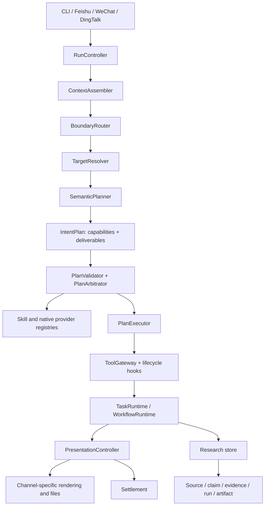

# Research agent design

OmniScientist is a local-first research agent harness. It combines a terminal
agent, durable workflows, portable skills, research provenance, and multiple
conversation channels without making any natural language a routing primitive.

This document states the product and architecture principles. The implemented
module map is in [architecture.md](architecture.md), memory is covered in
[memory.md](memory.md), and commands are listed in [commands.md](commands.md).

## Product goal

The product should feel as natural as a mature coding agent while enforcing
research-specific trust boundaries:

- a user can ask a direct question or request a multi-step research workflow;
- follow-up references bind to the active paper, task, source, or artifact;
- explicit skill choices are respected;
- tool use is constrained and auditable;
- long-running work can be inspected and recovered;
- conclusions, evidence, computations, and artifacts remain traceable;
- CLI, Feishu, WeChat, and DingTalk share one runtime and one research record.

## Language neutrality

All control-plane prompts, contracts, documentation, and help text are English.
This is not an English-only product. The semantic planner uses the configured
LLM to understand the current user turn and returns user-facing content in that
turn's language unless the user requests another language.

Routing does not depend on Chinese, English, or any language-specific keyword
inventory. Deterministic parsing is limited to protocol boundaries such as
slash commands, explicit skill references, identifiers, paths, and permission
decisions. Multilingual parity is covered by tests.

## Target architecture



### Responsibility boundaries

**RunController** creates a run id immediately and owns top-level status.

**ContextAssembler** compiles bounded context from session focus, attachments,
history, project memory, principal memory, and recent research objects.

**BoundaryRouter** handles only deterministic boundaries: commands, explicit
providers, identifiers, target references, permissions, and clearly missing
required input. It is not a semantic classifier.

**TargetResolver** binds references such as "this figure", "the previous
paper", and "that result" to structured objects. Explicit context and active
session focus outrank long-term memory.

**SemanticPlanner** asks the model for a structured intent plan. It proposes
capabilities, deliverables, targets, dependencies, and constraints. It does not
hard-code a skill name for an open-ended user intent.

**PlanValidator and PlanArbitrator** resolve providers from registry metadata,
validate schemas and contracts, and lock the executable plan. Once validated,
the executor cannot silently replan it.

**PlanExecutor** executes the locked plan: a schedule registration, a capability
runner, a memory write, or a bounded ReAct turn. Multi-step work is not sealed
into the plan; inside that turn the model calls `run_skill`, `run_workflow`, and
`spawn_subagents` and re-sequences against live results.

**ToolGateway and hooks** apply policy, permission, audit, and lifecycle events
to every tool, skill, native runner, and workflow action.

**PresentationController** renders the same structured result for each medium.
The CLI may show a concise trace; IM channels show user-facing progress, results,
and files. Full trace data remains in run events.

**Settlement** reads the durable record after the answer is written and decides
the terminal task status. It is bookkeeping, not grading: it never re-judges the
answer text, only whether children finished, claimed side effects actually
happened, whether named contract outputs are present on this task, and whether
the turn stopped on a budget bound.

## Capability-driven execution

Stable runtime concepts are capabilities and deliverables, not built-in skill
names. The active built-in Skill providers expose:

- `literature.search`
- `paper.fetch.arxiv`
- `artifact.figure`
- `figure.editable.pptx`
- `research.ideation`
- `slides.generate`

Omni-native execution also provides capabilities such as:

- `qa.grounded`
- `synthesis.final`
- `draft.section`
- `draft.manuscript`

External Skill libraries may add further capabilities without changing this
built-in activity list.

The planner may request `artifact.figure`; the registry decides whether an
installed built-in skill, project default, external skill, or native provider
can satisfy it.

Provider priority is deterministic:

1. an explicitly requested provider that passes policy and contract checks;
2. a built-in full-contract provider;
3. a built-in native executor;
4. a project-configured default;
5. an external full-contract provider;
6. an external partial provider in degraded mode;
7. clarification or a degraded direct answer when no provider is valid.

Support capabilities cannot replace terminal deliverables. A paper-fetch
connector can support paper analysis, but it cannot silently turn an analysis
request into a metadata-only result.

## Portable skill contracts

Skills remain portable `SKILL.md` assets compatible with Claude Code and Codex.
Omni-specific metadata is nested under `metadata.helixforge`:

```yaml
metadata:
  helixforge:
    role: support
    contract_level: full
    capabilities: [paper.fetch]
    input_schema:
      type: object
      required: [identifier]
      properties:
        identifier:
          type: string
          format: paper_identifier
          resolver: paper_identifier
          on_missing: needs_input
    output_contract:
      records: [source]
```

Runtime code understands schema formats and resolver names, not a particular
skill name. Third-party skills without Omni contracts can still be imported,
trusted, discovered by description in the ReAct loop, and explicitly selected
with `$skill-name`. They cannot serve as required steps in deterministic
automatic workflows; that stronger role requires a partial or full contract.

## Long-running workflows

A multi-step request is sequenced by the model, not by a plan-time DAG. The model calls
`run_workflow` with an ordered step list and that call creates a `WorkflowRun`. A step may name a
capability instead of a provider; the tool boundary resolves it against the live registry. Each
stable `WorkflowStep` records:

- step id, capability, selected provider, and contract level;
- structured input and expected output;
- required and optional dependencies;
- status, timestamps, errors, and recovery policy;
- emitted sources, claims, evidence, artifacts, and runs.

Every skill-backed step creates a separate Skill Execution attempt. Retrying creates a new attempt
while the WorkflowStep id remains stable. A step that needs nested agent planning creates a bounded
Child Task, which may own its own workflow, rather than nesting another workflow inside a Skill
Execution. Checkpoints preserve the last completed step, pending child work, emitted research
objects, and enough input state to recover the WorkflowRun.

## Research object model

Research trust is represented as data, not presentation copy:

- **Source** records a paper, dataset, URL, or connector record.
- **Claim** records a statement and calibrated confidence.
- **Evidence** links a source or result to a claim as support, contradiction, or
  mention.
- **Run** records computation, environment, command, metrics, and outputs.
- **Artifact** records a reviewable output and its ownership and version.

A final synthesis labels content as grounded, contextual, degraded, or missing
evidence. It must not turn an unsupported inference into a verified claim.

## Artifact lifecycle

Artifacts are active collaboration objects. A revision should:

1. bind to an explicit or focused source artifact;
2. create a new version rather than overwrite history;
3. preserve source-task and source-artifact links;
4. render derived formats;
5. validate output and revision quality in the **provider** (engine gates such as
   figure topology); the host does not re-grade the file;
6. record the render run and provenance;
7. promote the successful new artifact to session focus.

The review surface should expose versions, previews, diffs, and provenance. A
revision-like request without a source artifact asks for input rather than
generating a generic fallback.

## Research subsystems

### Literature and grounded QA

Connectors normalize external literature records into sources. Corpus tools
index local content and grounded QA cites retrieved spans. Network unavailability
produces a structured degraded result rather than fabricated metadata.

### Reproducible computation

Computation records the environment, command, seed where applicable, logs,
metrics, and output artifacts. Future local notebook, container, HPC, or cloud
providers must enter through the same permission and run-record boundary.

### Honesty auditing

`omni verify` audits the recorded claim/evidence graph on demand: unsupported
claims, contradicted claims, overconfident-yet-thin claims, and memory findings
that were never anchored to a source, claim, or run. It does not re-run the
model and it does not grade a deliverable — it reports what the record supports.

### Memory

Memory provides continuity without treating remembered text as evidence. Active
session focus outranks broad recall, and provenance references determine whether
a remembered finding can support final synthesis.

## Channel behavior

All channels call the same agent runtime. A turn normally has three phases:

1. acknowledgement with run id;
2. concise plan or progress updates appropriate to the medium;
3. settled result, files, evidence status, and next actions.

File-delivery failures enter a retry queue and are visible in the inbox and task
detail. They do not erase the completed local result.

## Comparison with coding agents

Omni adopts the useful harness patterns of Claude Code, Codex, and OpenClaw:

- context is assembled before planning;
- explicit user choices have priority;
- tools are exposed through policy rather than model guesswork;
- edits are followed by validation;
- long work has durable state and inspectable events;
- extensions are discoverable assets rather than business-code branches.

Its differentiator is the research object model and provenance-native output.
The goal is not autonomous science without supervision. The goal is a reliable
research collaborator whose work can be inspected, reproduced, corrected, and
continued over weeks.

For a concrete comparison of description-driven implicit invocation,
progressive loading, eligibility gates, installation roots, and Omni's
contracted capability lane, see [skills.md](skills.md#comparison-with-other-agents).

## Non-goals and invariants

- No language-specific semantic routing tables.
- No provider-specific business logic in the planner.
- No silent second routing after plan validation.
- No debug trace in IM responses.
- No claim of evidence when the evidence chain is incomplete.
- No external persistence dependency for the local product.
- No speculative registry or provider abstraction without an executable path,
  permission boundary, audit event, and test.
